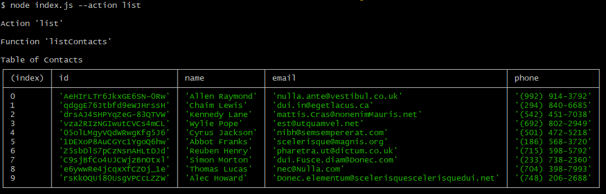
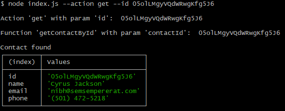
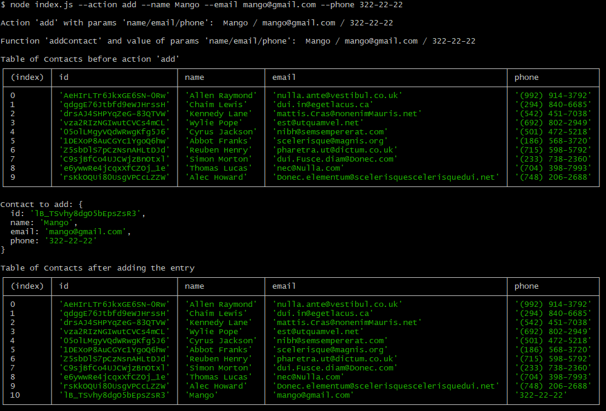
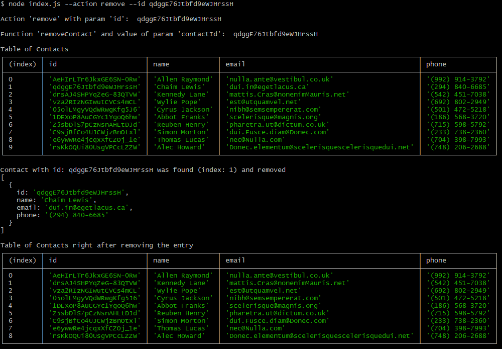

# Kurs [GoIT](https://goit.global/pl/courses/fullstack/): Fullstack Developer
# >>> Node JS <<<
## Zadanie zaliczeniowe (Homework) Sekcja 1 : - Podstawy Node.js. Tworzenie aplikacji konsolowych
## Wyniki
### 1. Cała lista kontaktów w postaci tabeli (console.table)
Polecenie: `node index.js --action list`

 

### 2. Otrzymujemy kontakt po id
Polecenie: `node index.js --action get --id 05olLMgyVQdWRwgKfg5J6`

 

### 3. Dodajemy kontakt
Polecenie: `node index.js --action add --name Mango --email mango@gmail.com --phone 322-22-22`

 

### 4. Usuwamy kontakt
Polecenie: `node index.js --action remove --id qdggE76Jtbfd9eWJHrssH`

 
